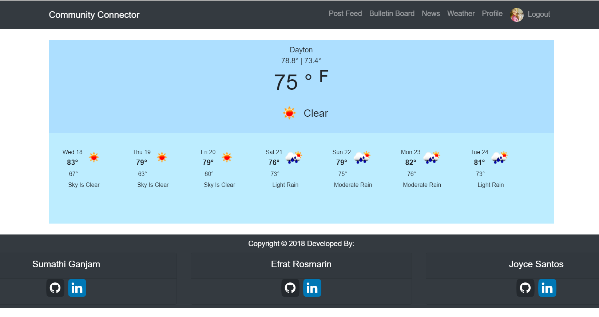

# CommunityConnector
A React App to keep Community Members informed and connected

Community Connector is a React App designed to keep Community Members involved, informed and connected.   

It includes 4 components 
- A Community Bulletin Board that lists all the open issues for the community and a place for each Community Member to be able to offer their feedback.  
- A Bulletin Board to post your personal reminders
- Top news feed from New York times
- Weather to see the next week's weather forecast

## Contributors
* **Sumathi Ganjam** [github](https://github.com/ghSB17)
* **Efrat Rosmarin** [github](https://github.com/efratrosmarin)
* **Joyce Santos** [github](https://github.com/puppitty)

## Who could use this app:
This app is designed to help improve communications within communities. Possibilities include Home Owners Associations and small townships/municipalities.

## Built With:

- axios,
- bcryptjs, 
- body-parser, 
- classnames,
- dotenv, 
- express, 
- gravatar, 
- jwt-decode,
- jsonwebtoken, 
- moment,
- mongoose, 
- Mongo
- passport, 
- passport-jwt,
- react, 
- react-dom, 
- react-draggable, 
- react-fa, 
- react-icons, 
- react-redux, 
- react-router-dom, 
- react-scripts, 
- redux, 
- redux-thunk, 
- New York times (API's)
- openweather API

### ERD

### Community Connector
* Home Page

* User Login

* User Sign-un 

* Post feed for Admin 

* Post feed for User 

* Bulletin Board

* Top News Feed  

* Weather 

* Profile 

### Quick Start

To run a local / development copy:

Clone the repository and then follow the steps below:
- cd CommunityApp
- npm install
- cd client
- npm install
- cd..
- Create .env file with the following keys:
  * nytAPI=YOUR_NEWYORKTIMES_KEY
  *  MONGODB_URI=YOUR_MONGO_DB_INFO
  *  secretOrKey=YOUR_CODE
  *  GOOGLE_GEOLOCATION_API_KEY=YOUR_GOOGLE_GEO_LOCATION
  *  OPEN_WEATHER_API_KEY=YOUR_OPENWEATHERMAP_API
- npm run dev

